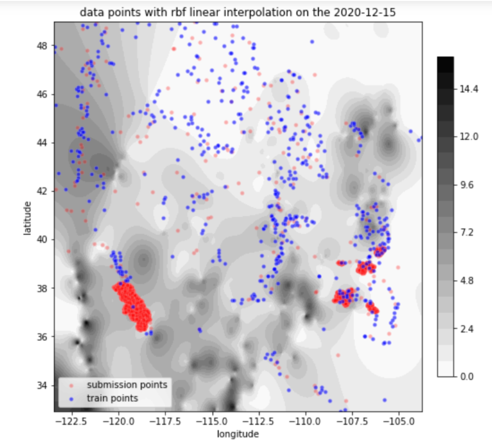
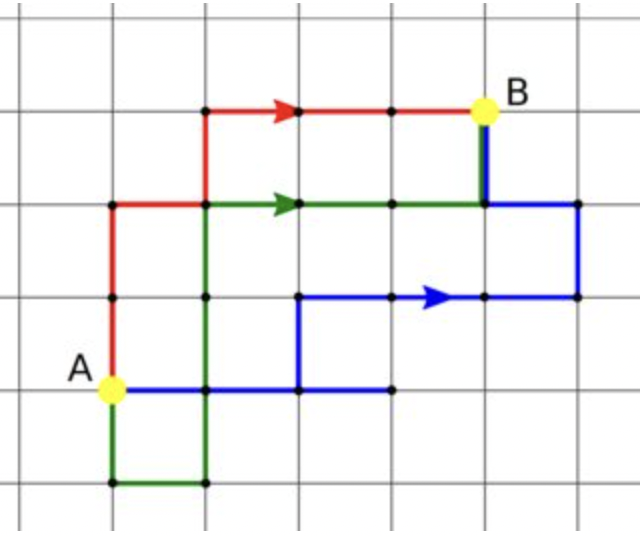
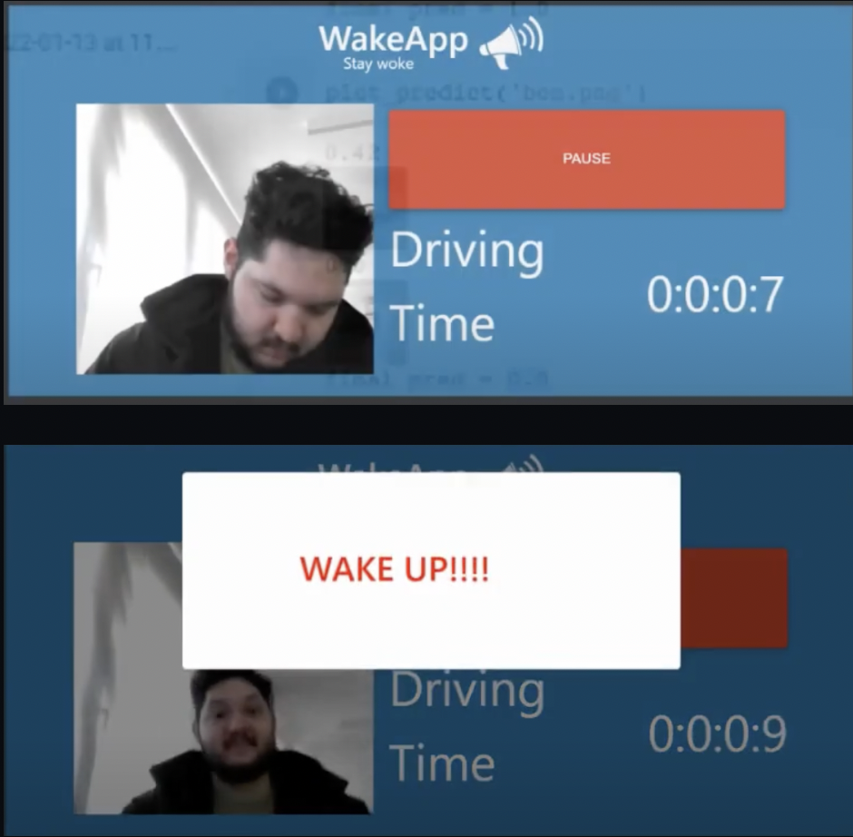

## Welcome to Ben Hendel's Data Science Page

To whom it may concern,

I am a young professional who specializes in the intersection of data science and geography. I have been developing skills in experiences in R, Python, ArcGIS, and statistical modeling, and this page will be used to house projects both exploratory and educational. My projects for consulting, government, and hi-tech are not public due to confidentiality reasons.

### "Snowdown Showdown"

A breakdown of a spatial/temporal model for predicting snowfall across the United States as part of the Snowcast Showdown Driven Data competition.

<a href="Snowdown Showdown.pdf">Snowdown Showdown</a>

### "Lost at Six Flags"

A simulation that attempts to answer this question: If you lose someone, is it better if both people search for each other or if one searches and the other stays still? The experiment, variable conditions, and results are presented here.

<a href="Lost_At_SixFlags.ipynb">Notebook</a>
<a href="Lost_At_SixFlags.html">HTML Form</a>
<a href="Lost_At_SixFlags.pdf">PDF</a> 

### "WakeApp"

Our winning entry in the 2022 ITC Transportation hackathon, an app that alerts drivers when they doze off. Computer vision is used to detect when eyes in the image have stayed shut.

<a href="https://github.com/Rtutorials/WakeApp-Backend">Github</a> 
<a href="https://youtu.be/fTslVKN8JVU">Video</a> 

### "2017 Education Spending in the State of California"

The link below is to a class presentation I contributed to in 2017, looking at public school construction projects. I hope you find it valuable! 

<a href="Final_Presentation.html">141B Project</a> 

### "Wave Your Hand to Control Your Device: Creatiion and Feasibility Testing OS Hand Gesture Control"

This is a project report for ISYE 6740:Computational Data Analysis as part of Georgia Tech's OMSA Master's program. I used computer vision and Convolutional Neural Networks to create potentially useful automation software through webcam hand gestures connected to scripts and automation software. Several OS functions like navigating windows, controlling settings, editing text, and even controlling MIDI musical instruments

<a href="HandGestureControlProject.pdf">PDF</a> 

### Support or Contact
 If you want to contact me (or employ me!), you can reach me at bhendel 'at' ucdavis.edu. 
 
